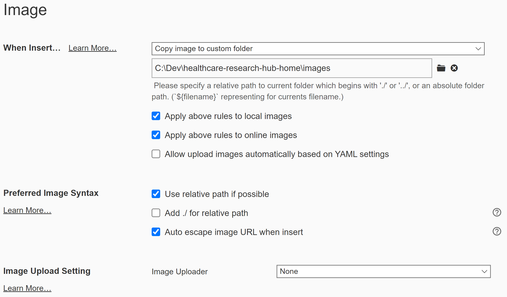

# CSS Setup

To correctly display our custom ordered list numbering and info box (block quote with shaded background) within the Typora editor, follow the steps at [Add Custom CSS - Typora Support](https://support.typora.io/Add-Custom-CSS/) to create a github.user.css file containing:

```
/* Numeric, alpha, roman nested lists */
ol {
  list-style-type: decimal;
}

ol ol {
 list-style-type: lower-alpha;
}

ol ol ol{
 list-style-type: lower-roman;
}

/* Turning quote into info box */
blockquote {
    border-left: none;
    padding: 10px 10px 10px 10px;
    margin-left: 1.5em;
    margin-right: 1.5em;
    color: #333333;
    font-size: .8em;
    font-style: italic;
    border-radius: 5px;
    background-color: #edf3fc;
}
```


# Image Setup

In Typora, configure **File > Preferences > Images** to match:

{:.thinborder}

The easiest image capture and placement steps we have so far are:

*  In the Figma desktop app, copy the desired component image and paste it to the **---Technical Doc---** page.

*  Rename the pasted image ***\<same-name-as-md-file\>*.png**.

*  Export the pasted image as PNG to **C:\Dev\healthstack-ghpages\images**.

   > When accessing Figma in a browser window, you have to manually move the file from the downloads folder.

*  Wait for the action completed message to appear at the bottom of the Figma window.

*  In Typora, from **Format > Image > Insert Local Images**, select the image.

* Images render to the web with a drop shadow by default.

  *  To remove the drop shadow, add  `{:.noborder}` to the image markdown syntax.
  *  To replace the drop shadow with a 1px border, add  `{:.thinborder}` to the image markdown syntax.


> The drop shadows and thin borders do not appear in the Typora editor. The `{:.class}` syntax is a GitHub-Flavored Markdown (GFM) proprietary extension. To see an example of the full syntax, click the image above.


**---- Everything below is now superceded by what is above. ---**

<span style="color:red">Don't try to look at this file as rendered html. It'll be way wrong. Just look at in as an .md in Typora.</span>

The following line shows the syntax to use for inline screenshots. theme-samsung.css adds a dropshadow by default.



To remove the dropshadow, use:



To replace the dropshadow with a 1px border, use:



For example, the image below uses:



Initial setup steps:

* In Typora, configure **File > Preferences > Images** to match:

  {:.thinborder}

Though not ideal, the easiest image capture and placement steps we have so far are:

*  Copy/paste the line into the Typora .md file.
*  In Figma, copy the desired component image and paste it to the **---Technical Doc---** page.
*  Rename the pasted image *same-name-as-md-file.png* and at the same time copy the name to the clipboard.
*  Export the pasted image as PNG.
*  Wait for the copy complete message to appear at the bottom of the Figma window.
*  Move the PNG from the downloads folder to C:\Dev\healthstack-ghpages\images.
*  In Typora, double-click the word *filename* and type ctrl-v to paste the name saved in the clipboard.
*  Review the results in the local web.

> The filename must not include any path info - just the filename.

Alternate steps:

*  Copy/paste the line into the Typora file.
*  In Figma, copy the desired component image and paste it to the **---Technical Doc---** page.
*  Right-click the pasted image and select **Copy/Paste as > Copy as PNG**.
*  Wait for the copy complete message to appear at the bottom of the Figma window.
*  Double-click the word *filename* and type ctrl-v to paste the image into the Typora file.
*  Double check the image because it will disappear in the next step. :-(
*  Delete the following bold text:
   
   So that it looks like this:
   
* Review the results in the local web.

> The filename must not include any path info - just the filename.