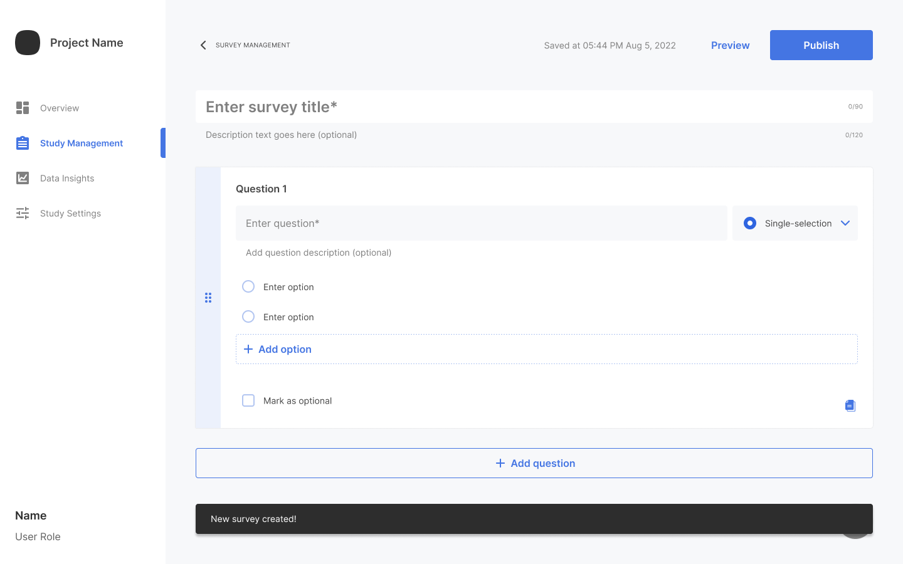

A survey is a sequence of questions that collect information from the participants in your study. You create surveys through the Samsung Health Stack web portal.

> As you create the survey, the portal automatically saves your changes. During moments when network connectivity is lost, your changes are temporarily held offline and then automatically saved when connectivity returns.

To create a new survey:

1. From the **Study Management** page, click **Create survey**.
    

1. Enter a title and optional short description for your survey.

3. Create your first survey question:

    1. Select a question type:
        - **Single-selection** – Multiple choice question that allows only one selection.

        - **Multi-selection** – Multiple choice question that allows one or more selections.

        - **Slider scale** – Simple symptom scale or agreement level question that allows one choice from a range of numbers.

    2. Enter the question and an optional short description.

    3. For each possible answer:
        - For **Single-selection** and **Multi-selection**, click **Add option** and enter text for the answer option. Use the right-side handles to drag and drop the choices in your desired order.
        - For **Slider scale**, select minimum and maximum slider range values and optionally label each.

    4. Optionally, select **Mark as optional** to allow participants to skip the question.

4. Click **Add question** and repeat the previous step for each question in your survey.

    > To quickly start a new question, click the **Copy** icon in the lower right of a similar question.

5. Use the left-side handles to drag and drop the questions in your desired order.

    > The survey is stored in **Draft** mode on the **Study Management** page until you are ready to publish.
