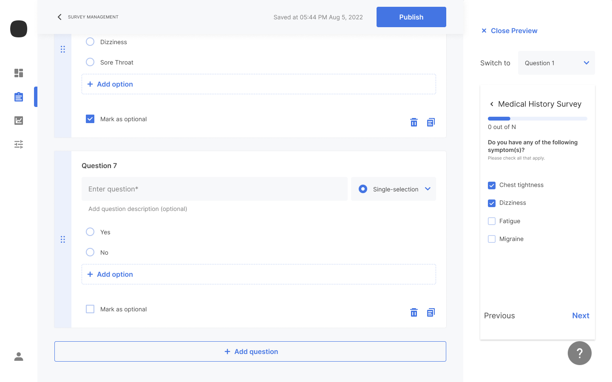

Previewing allows you to see how your survey will look in the app. Preview is available at any point in the survey question creation process.

To preview a survey:

1. From the **Create survey** page, click **Preview** to display the first question in app format in the right pane.
   
2. Use **Previous** and **Next** to navigate through the questions or select any question from the **Switch to** list.
3. Click **Close Preview** to close the right pane.

