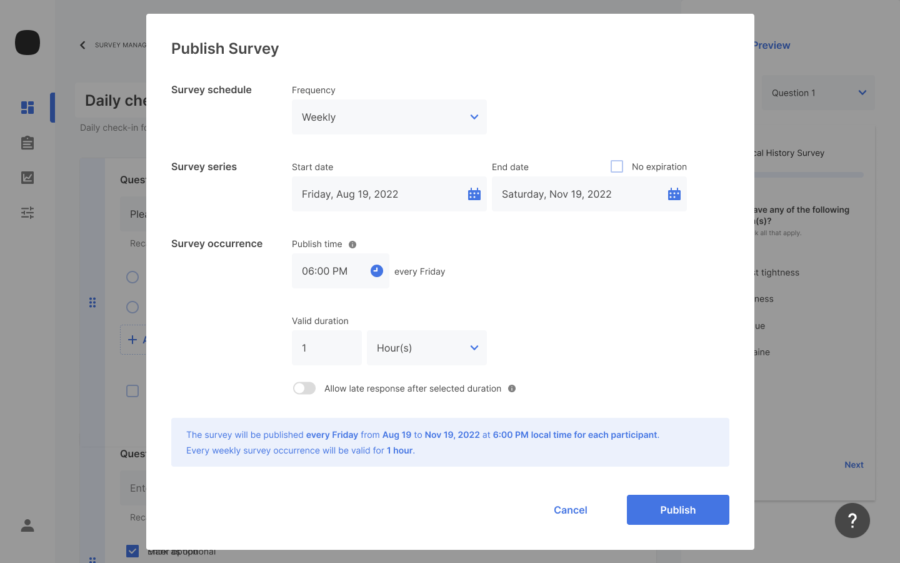

Once you've completed creating your survey questions, the next step is to schedule and publish the survey. You schedule and publish surveys through the Samsung Health Stack web portal.

To schedule and publish a survey:

1. From the **Create survey** page, click **Publish**.
    
2. Select the **Frequency** that participants will repeat your study. The options are:

    - One-time - Participants complete this survey type only once.
    - Daily - Participants complete this survey type each day of the study.
    - Weekly - Participants complete this survey type once a week for the duration of the study.
    - Monthly - Participants complete this survey type once a month for the duration of the study.
    > In version v0.9, specifying a monthly survey to occur on the 29th, 30th, or 31st results in the survey not occurring in months without the specified day.<!--For months with fewer days than the date selected, the survey occurs on the last day of the month.-->
3. For **Publish time**, select the dates and times to start and end when the survey is accessible in the app.
 > **Publish Time** <!--is local time for each participant and -->must be in the future for all participants and displays in the local time for the Eastern-most participant.
1. For **Valid duration**, specify the length of time that each occurrence of the survey remains available to participants.
2. Optionally, select **Allow late response after selected duration** to allow participants to take the survey even after the specified **Valid duration** time has passed.

   > This feature has not been implemented in version v0.9.
3. Click **Publish**.

> Once published, surveys cannot be modified in Samsung Health Stack v0.9.
