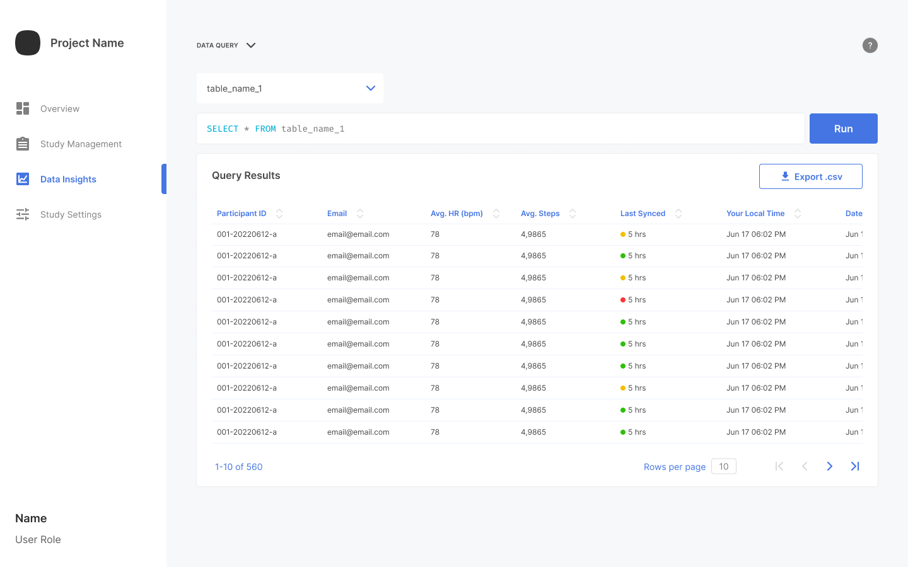

The web portal provides a straightforward way to export your data to **.csv** files for further analysis in popular data analysis tools such as SPSS, R, and Matlab. 

> For simple insights into your data from within the web portal, refer to [Running a Data Query](running-a-query.md).

To export **.csv** data:

1. From the **Data Insights** page, click **Export .csv**.
   
2. Use the standard file browsing interface to export the data to the desired folder and filename.

