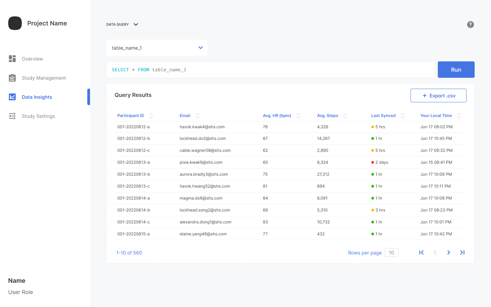

Querying within the web portal allows you to gain some simple insights into your data. You can run queries at any point in the study.

> For more detailed analysis, refer to [Exporting Data for External Analysis](exporting-data.md).

To run a data query:

1. From the **Data Insights** page, in the **Data Query** section, select a table from the **Select a table** list to set the query input to `SELECT * FROM <table>` and populate **Query Results** with all rows of the table.

   

2. Adjust the `SELECT * FROM <table>` query statement using any valid SQL syntax. Refer to the [full-stack tutorial](../get-started/tutorial.md#analyze-the-results) for a complex query examples.
   > Changing the table automatically updates the **Select a table** list selection.

3. Click the standard column header arrows to sort the output on a particular column.

4. Hover over a column header and click the **X** to remove the column from the query.

5. Click **Run** to apply your adjustments and rerun the query.