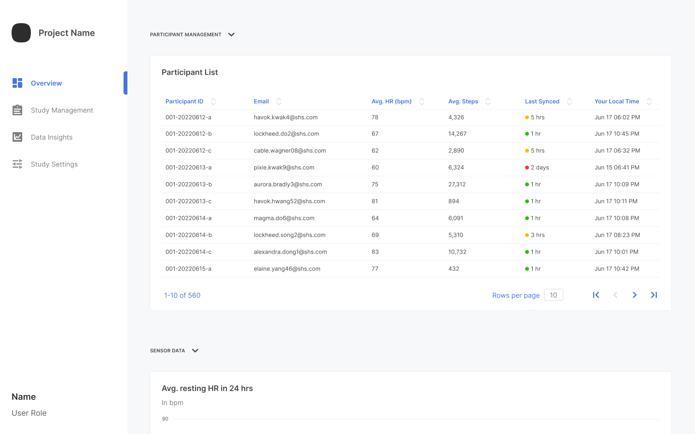
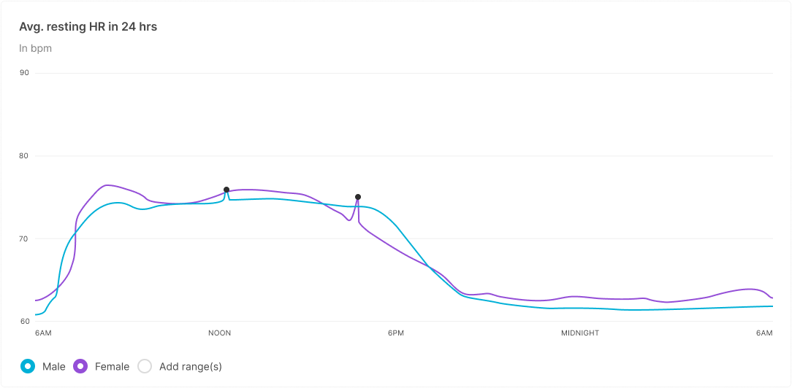
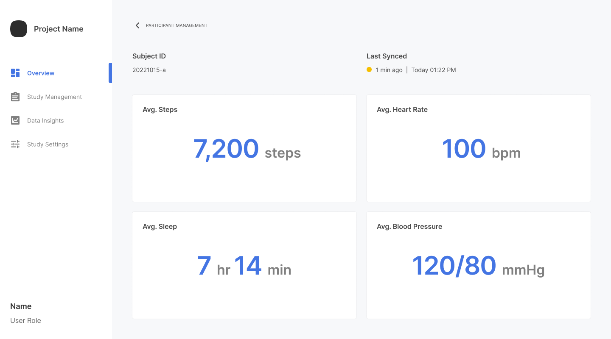

The portal reports individual participants' average records per data class. The reporting includes data such as average step count or average heart rate. You can view the records of:

- A specific participant.
- A participant relating to a datapoint of interest.

To view individual participant records:

1. From the **Overview**, **Study Management**, or **Data Insights** page, navigate to the **Participant Management** section.
   
   
1. In the **Participant ID** column, click the desired participant.
   

To view records of the participant associated with a particular datapoint:

1. From the **Overview** page, navigate to the **Sensor Data** section.
   
2. Scroll to the desired graph or chart.
3. Click a specific datapoint.
   

> For more information about graphs and charts, refer to [Viewing Graphs and Charts](./viewing-graphs.md).