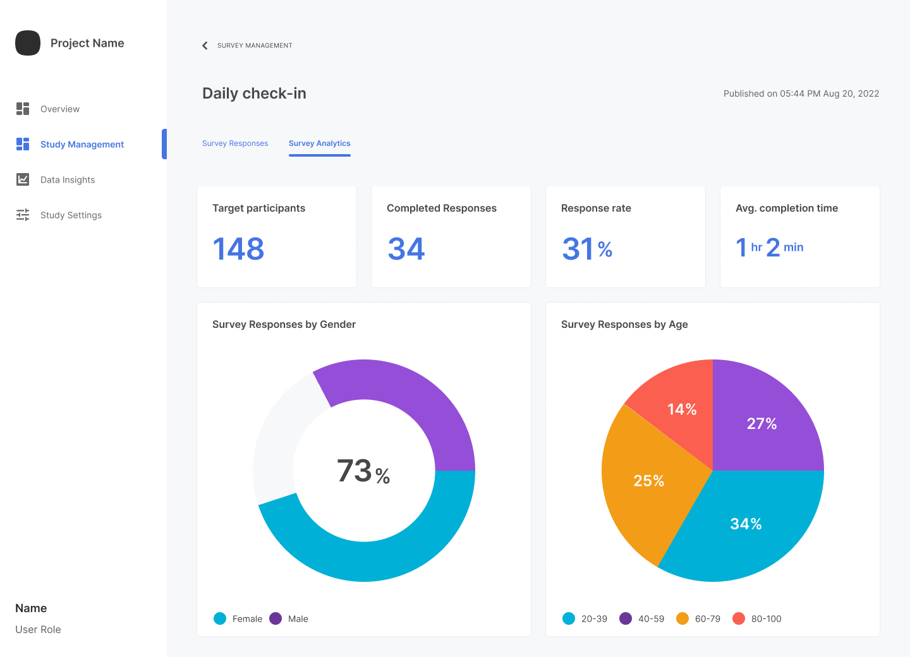

The web portal provides easy visualization of survey response analytics. For each published survey, participation details and charts showing response percentages by gender and by age give you up-to-the-minute analytic data.

To view survey response analytics:

1. From the **Study Management** page, navigate to the **Survey Management** section.
2. Under **Published**, click any survey.
3. Click the **Survey Analytics** tab.
    
4. In the top part of the page, view the participation details.
5. In the bottom part of the page, view the charts showing survey participation percentages by gender and by age.
