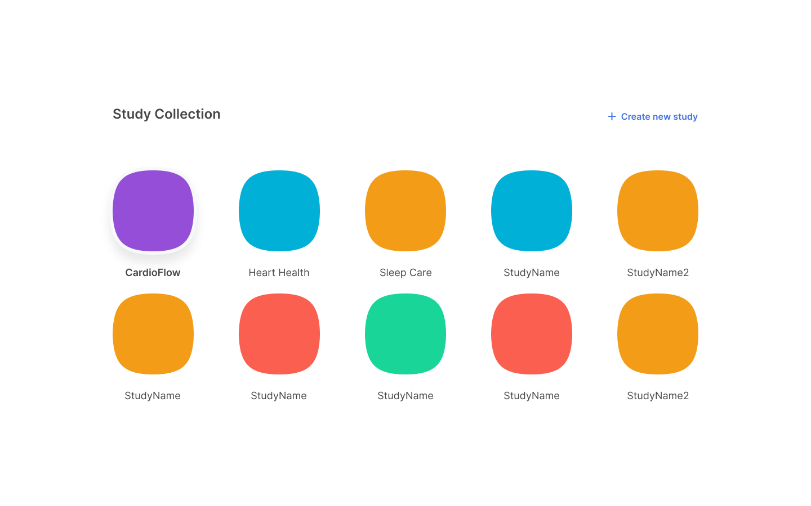

A Samsung Health Stack study is a container you create to manage all aspects of your participant study. A container consists of the team members running the study, the list of participants, participant surveys, survey results, participant vital signs tracked through the wearable device, graphs giving insights into the data collected, and more.

> As of this writing, Chrome is the only browser supported for accessing the web portal.

To create a new study:

1. From anywhere within the web portal, click the current study name displayed in the top, left corner of the portal window.
    

2. On the **Study Collection** page that appears, click **Create new study**.

    > When logging in to the portal for the very first time, the **Create a study** page automatically appears instead.

3. Enter a name for your study.

4. Select a color for the study logo.

5. Click **Create Study**.

When created, your account settings identify you as the creator of the study.

<!-- Hopefully only the second half of this sentence is needed to add to the sentence above for v1.0...  When created, the system adds the `Study Creator` [study role](role-based-access-control.md#study-roles) to your account settings for the specific study and `(Study Creator)` appears next to your name in the **Members and access** table.-->
