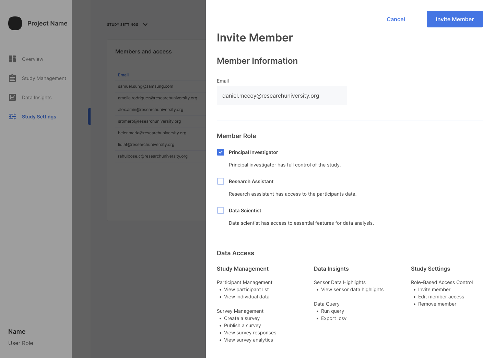

# Overview

Members are the people who are conducting the study. Your team consists of as many members as is pertinent for you. Thus, the Samsung Health Stack puts no restrictions on the number of members working on studies in your organization. Each study can have any number of the members participate in conducting the study. And, member management happens at the study level.

These actions are available for managing the members participating in a given study:

- [Inviting Members and Assigning Roles](#Inviting -members-and-assigning-roles)
- [Editing Member Information](#editing-member-information)
- [Removing a Member from a Study](#removing-a-member-from-a-study)

# Inviting Members and Assigning Roles

Invite as many members to help conduct your study as you desire.

<!-- Not all members can invite other members. Refer to [study roles](role-based-access-control.md#study-roles) for details.-->

To add a member to the study and assign the member a role for the study:

1. From the **Study Settings** page, in the **Study Settings** section, click **Invite member**.
    

2. Enter the email address of the person to invite to the study.

3. Select a study role for the member for this study. The [role-based access control](role-based-access-control.md) feature provides security with differing levels of access permission granted to different roles:

    - Principal Investigator - has full access to all aspects of the study.
    - Research Assistant - has access to the participant data.
    - Data Scientist - has access to essential features of the data analysis.

    > `Principal Investigator` is the only study role available in version v0.9 of the portal. And the role appears in the **Members and access** table as `Reseracher`.

4. Click **Invite Member** to add the member to the study.

5. Notify the person that you have added them as a member for the study in the best way for your use case.

> If the person does not already have an account, they receive an account activation email containing instructions to create their account.

When completed, the system adds the selected study role to the person's account settings for the specific study.

> People can have different roles for different studies.

# Editing Member Information

> The portal UI for this feature is complete, but the backend code wasn't completed in time to be included in the beta version. For beta, the action simply silently fails.

To edit a member's information for the study:

1. From the **Study Settings** page, in the **Members and access** table, locate the row with the desired member and click **EDIT**.
2. Adjust the data to your liking.
3. Click **Save**.

# Removing a Member from a Study

> The portal UI for this feature is complete, but the backend code wasn't completed in time to be included in the beta version. For beta, you get a success message, but the member is not removed.

To remove a member from a study:

1. From the **Study Settings** page, in the **Members and access** table, locate the row with the desired member and click **EDIT**.
2. Click **Remove member from study**.